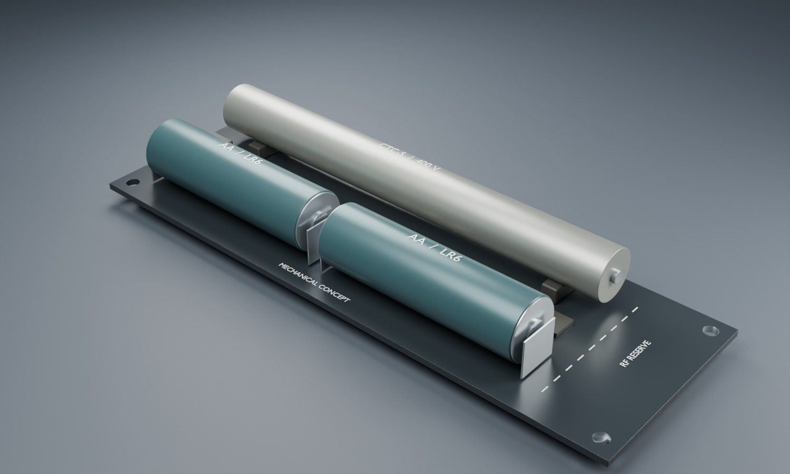

# geiger2

**In plain terms:** a pocket-sized gadget that listens for radiation with an old Russian Geiger tube, runs on two AA batteries, and talks to your phone over Bluetooth — so you can see counts without a custom app receiver. We’re designing a new board from scratch (not a clone of the 2014 wireless Geiger), with a proper high-voltage supply that can report its own voltage, then building it at JLCPCB.

Clean-sheet **Bluetooth Geiger counter**: nRF52832, CTC-5 (STS-5 / СТС-5) NOS Russian GM tube, regulated ~400 V bias with ADC readback, JLCPCB 2-layer PCB, authored in **tscircuit**.

Prior art: [wirelessGeigerCounter](https://github.com/sawaiz/wirelessGeigerCounter) (requirements only — not a port). See [docs/prior-art.md](docs/prior-art.md).

## Design study · September 2026



**Mechanical concept, not a routed PCB.** Proposed 140 × 48 mm envelope with
parallel CTC-5 and 2×AA, plus an RF reservation at one end. The tube, contacts and
HV components are stand-ins; [model provenance and views](cad/README.md).


The exploratory HV model regulates near 400 V at a 1 µA external load across
1.8–3.2 V input. A permanently connected divider adds about 3 µA load. Real switch
drive, controller current and device losses still need validation.

- [HV calculations, plots, assumptions and reproduction](docs/hv/README.md)
- [JLC component selection and unresolved electrical checks](docs/component-selection.md)
- [Battery/load sweep](docs/hv/load-sweep.png) · [energy trade-offs](docs/hv/tradeoffs.png)
- [Top view](cad/renders/top.png) · [tube view](cad/renders/tube.png) · [profile](cad/renders/profile.png)
- [Download concept 3D model](cad/renders/geiger2-concept.glb)

## Goals

| Area | Decision |
|---|---|
| MCU / radio | **nRF52832-QFAA-R** (LCSC C77540) bare + **PCB inverted-F antenna** — [docs/mcu-rev-a.md](docs/mcu-rev-a.md) |
| Bluetooth | Advertising **plus** connectable **GATT** (config / telemetry) |
| Detector | CTC-5 / STS-5 halogen GM tube (NOS), ~110 mm × Ø12 mm |
| Layout | Handheld: **tube one long side**, **2×AA the other** (parallel, similar length); closed plastic shell |
| HV | Free-running regulated ~400 V + **ADC readback** (not MCU PWM) |
| Power | 2×AA, beacon clips MY-ZJ-3030 (`C964874`) / MY-AA-03 (`C19184098`); alkaline floor by default |
| Fab | JLCPCB **2-layer**; DRC from beacon **0.8.6 JLC-preferred** mins — [docs/jlcpcb-drc.md](docs/jlcpcb-drc.md) |
| UI (rev A) | Status LED; raw CPM in ads/GATT (µSv/h later) |
| PCB CAD | **tscircuit** board-as-code (muon3-style); 3D models in [cad/](cad/) |

## Tube (CTC-5 / STS-5)

| Parameter | Typical |
|---|---|
| Operating voltage | **360–440 V** (~390–400 V nominal) |
| Starting / counting | ~280–330 V |
| Plateau | ≥ 80 V, slope ≤ ~0.125 %/V |
| Anode load | 5–10 MΩ |
| Size | ~110 mm × Ø12 mm |
| Sensitive to | β / γ; SBM-20 class precursor |

Verify each NOS tube on the bench. HV setpoint mid-plateau with continuous readback.

## Architecture (draft)

```
2×AA → nRF52832 (direct VBAT)
         ├─ PCB inverted-F antenna (BLE adv + GATT)
         └─ free-running HV (~400 V)
                ├─ CTC-5 anode (5–10 MΩ)
                ├─ divider → SAADC HV_SENSE
                └─ pulse front-end → GPIOTE GM_PULSE
```

Open: final HV part numbers, CTC-5 clip MPN, RF match after layout, shell CAD.

## Repo layout

```
board/            tscircuit HV ladder review schematic (not a complete PCB)
cad/              3D models for renderings (AA, clips, nRF52832, CTC-5 approx)
docs/             HV studies, component review, MCU pin budget, prior art, JLCPCB DRC
sim/hv/           native and tscircuit SPICE sources
scripts/          reproducible simulations, plots and Blender renders
firmware/         nRF52 firmware (TBD)
hardware/pcb/     KiCad DRC seed only
manufacturing/    JLCPCB BOM/CPL when ready
```

## Manufacturing

- JLCPCB FR4, 2 layers, 1.6 mm, 1 oz, **black** mask, **white** silk, ENIG
- Rules: [docs/jlcpcb-drc.md](docs/jlcpcb-drc.md)

## Status

- MCU + pin budget locked; product locks (GATT, handheld shell, tube‖AA layout) documented
- 3D assets staged under `cad/models/` for board renders
- 16 native ngspice feasibility cases, plots and reproducible scripts generated
- tscircuit analog simulation and HV ladder schematic source added
- Four Blender mechanical concept views and GLB generated
- Complete MCU/RF/HV schematic, real switch drive, routing and fabrication release remain open
