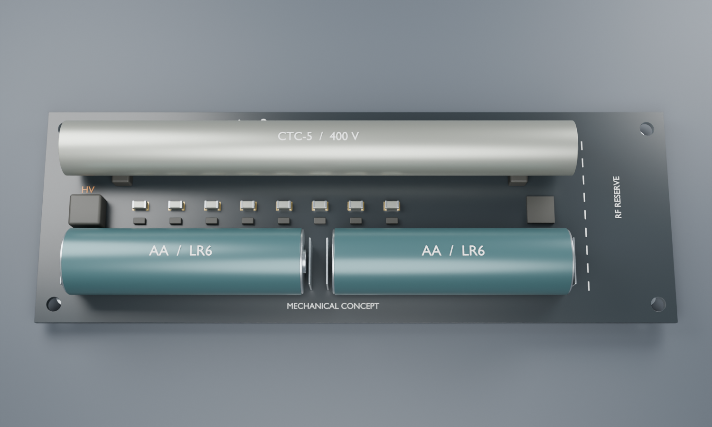

# CAD / 3D models for geiger2 renderings

## Layout lock
Handheld: **CTC-5 along one long side**, **2×AA along the other** (parallel, similar ~110 mm length). Closed plastic shell later.

## Models in `models/`

| File | Source | Use |
|---|---|---|
| `aaCell.step` | x.drop-beacon `pcb/components/aaCell/` | AA cell body (×2) |
| `AA-LR6.FCStd` | same | FreeCAD parametric AA |
| `MY-AA-03.step` | beacon | Negative spring contact |
| `MY-ZJ-3030.step` | beacon | Positive contact |
| `NRF52832-QFAA-C77540.step` | tscircuit/EasyEDA modelcdn C77540 | SoC |
| `NRF52832-QFAA-C77540.obj` | same | SoC (mesh) |
| `QFN48.step` | beacon CC1310 QFN (fallback) | Only if C77540 model fails |
| `CTC5-approx.stl` | Generated Ø12×110 mm cylinder | Tube stand-in until better STEP |

## From wirelessGeigerCounter (`from-wirelessGeigerCounter/`)
Inventor history: `Acrylic Tube Housing.ipt`, `Back Cap.ipt` (SBM-20 era acrylic shell). **Not STEP** — needs Inventor/Fusion export for tscircuit. Useful as shell reference, not drop-in cadModel.

Better public STEP exists (GrabCAD / Marathon “SBM20-CTC5.step”, ~109.2×12 mm) — import manually if license OK; until then use `CTC5-approx.*`.

## tscircuit wiring
Prefer `cadModel={{ stepUrl, objUrl }}` like muon3 imports (EasyEDA CDN for JLC parts). For local files, use paths under `cad/models/` or host via modelcdn after `tsci` import.

## Generated mechanical concept

Generated by `blender --background --python scripts/render_concept.py` from the
repository root. Four Cycles views: [hero](renders/hero.png), [top](renders/top.png),
[tube](renders/tube.png), [profile](renders/profile.png). The assembly is available
as [GLB](renders/geiger2-concept.glb); editable Blender scene regenerates in
ignored `build/geiger2-concept.blend`.

Proposed board envelope: **140 × 48 × 1.6 mm**. Tube center (-8, 13) mm, body
110 × Ø12 mm. AA centers (-36, -12) and (20, -12) mm, 50.5 × Ø14.5 mm envelope.
RF region begins at x=51 mm; this is a mechanical reservation, not a validated
antenna keepout or drawn RF element. Origin is board center.

The nRF52832 uses the supplied OBJ. Battery cells, battery contacts, tube, tube
supports and HV part envelopes are deterministic geometric stand-ins. Original
STEP files are retained in `models/`. FreeCAD's installed Python/Qt runtime failed
with an incompatible-processor error while tessellating STEP; `scripts/tessellate_models.py`
records the attempted conversion path. No converted meshes are claimed present.
The tube model is approximate, and final battery/tube contact fits remain open.

There is no routed KiCad PCB to export or DRC-check yet. These views establish
packaging intent; mounting holes, supports and component positions are provisional.
No copper traces, antenna geometry or enclosure qualification are inferred from
the image. The short-side room for RF and the central electronics corridor need
rechecking against the completed schematic and selected contact geometry.
