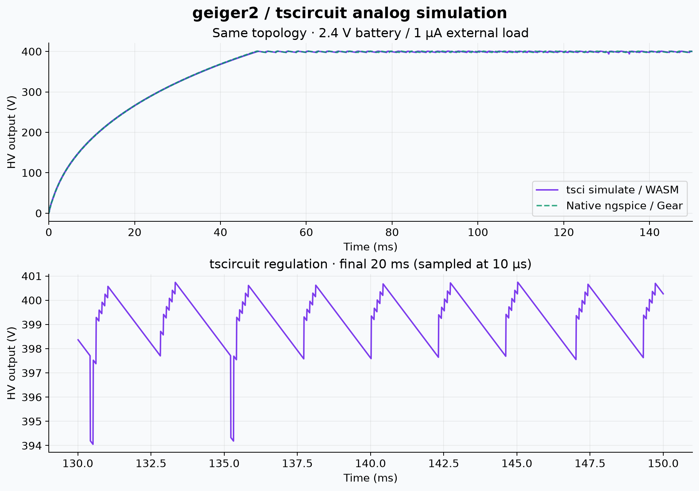
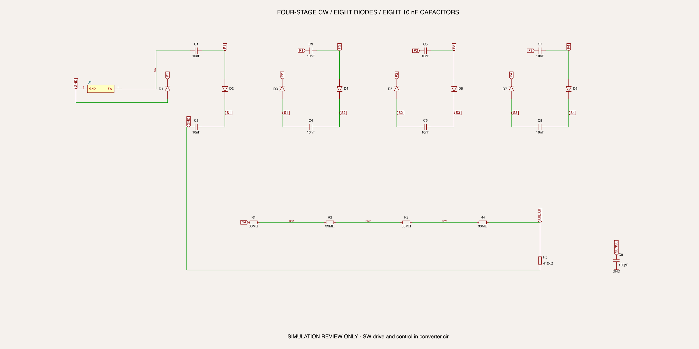
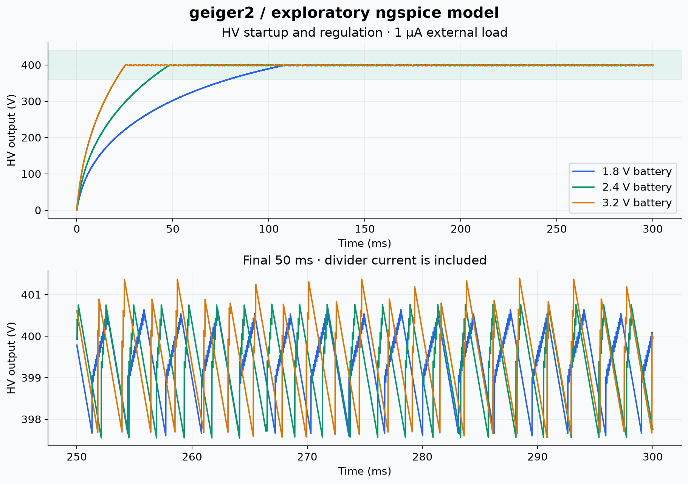
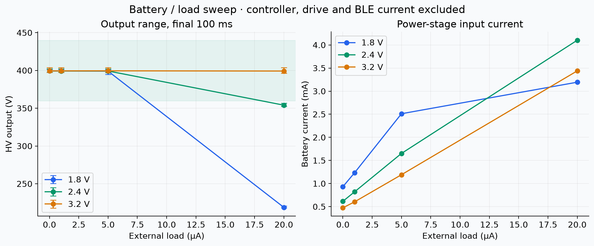
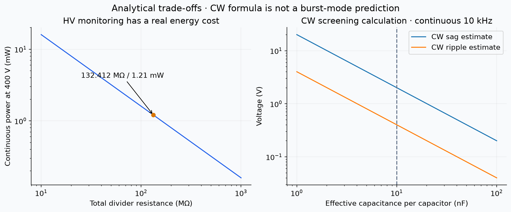

# HV converter feasibility study

**Status: simulated topology, not a validated hardware design.** The supply has
real SPICE inductors, capacitors, diodes and feedback, with a generic switch and
behavioral oscillator/comparator. These results establish an engineering baseline;
they do not establish efficiency, battery life or accuracy of a populated board.
No tube pulse amplitude or dead time is inferred from this load model.

## Topology and assumptions

2×AA → 1 mH inductor → switched node → four-stage half-wave Cockcroft–Walton
multiplier → approximately 400 V. Four stages mean **eight diodes and eight
capacitors**. The switched node's approximately 100 V peak-to-peak waveform pumps
the ladder; a DC 100 V rail alone would not do this.

Source: [converter.cir](../../sim/hv/converter.cir). The tscircuit simulation wrapper
is [hv.circuit.tsx](../../sim/hv/hv.circuit.tsx), with the subcircuit generated from
the same native source by [sync_spice_model.py](../../scripts/sync_spice_model.py).

| Parameter | Baseline |
|---|---:|
| Battery | 1.8 / 2.4 / 3.2 V, 0.5 Ω source resistance |
| Input capacitor | 22 µF ideal |
| Inductor | 1 mH, 8 Ω series DCR, linear (no saturation/core loss) |
| Clock | 10 kHz, 20 µs on-time, 50 ns edges |
| Power switch | ideal controlled switch, 2 Ω on, 30 pF drain capacitance |
| Diodes | generic model: 2 nA Is, n=1.7, 2 Ω Rs, 2 pF Cjo, 50 ns Tt, 250 V BV |
| CW capacitors | 8×10 nF effective; no ESR/leakage model |
| Monitor divider | 4×33 MΩ + 412 kΩ, always connected |
| Sense capacitor | 100 pF |
| Comparator | 1.242 V center, ±4 mV input hysteresis, 40 µs output RC |
| External load | 0 / 1 / 5 / 20 µA, smoothly reduced below 100 V for startup |
| Initial state | capacitors discharged; controller initially enabled |

The reference topology is motivated by [ADI CN0536](https://www.analog.com/media/en/reference-design-documentation/reference-designs/cn0536.pdf).
That design uses different drive conditions, values and feedback pickup. Its measured
current must not be reused as a geiger2 prediction. The proposed comparator family
is [TI TLV3012B](https://www.ti.com/lit/ds/symlink/tlv3012.pdf); its actual delay,
offset, hysteresis range, startup and reference tolerances need corner modeling.

## Calculations

For discontinuous inductor current, a first screen is:

- `Ipk ≈ VBAT × ton / L` → 36 / 48 / 64 mA at 1.8 / 2.4 / 3.2 V, before DCR.
- `Ecycle ≈ L × Ipk² / 2` → 0.648 / 1.152 / 2.048 µJ.
- At continuous 10 kHz those energies correspond to 6.48 / 11.52 / 20.48 mW,
  before converter losses. Burst regulation reduces the average.
- Divider ratio `(132 MΩ + 412 kΩ) / 412 kΩ = 321.38835`.
- Reference center `1.242 × 321.38835 = 399.164 V`; ideal comparator thresholds
  are approximately 397.879 and 400.450 V. Stored energy and delay cause overshoot.
- Divider current at 400 V is **3.021 µA**, and continuous dissipation **1.208 mW**.
  This exceeds a 1 µA external load's 0.4 mW. No-load is not zero HV load.
- SAADC input would be 1.2446 V at 400 V; input impedance and power sequencing
  still need design validation.

For equal-capacitance, continuously driven half-wave CW screening, with `n=4`:

`ΔV ≈ I / (f C) × (2n³/3 + n²/2 − n/6)`

`Vripple ≈ I / (f C) × n(n+1)/2`

At 4.02 µA total load, 10 kHz and 10 nF, these estimate 2.01 V sag and
0.402 V ripple. **Burst-mode ripple must come from the transient simulation**;
these equations assume continuous drive and do not predict comparator hysteresis.

## tscircuit analog simulation



Actual `tsci simulate analog` result: **849,452 adaptive points over 150 ms**, at
2.4 V input / 1 µA external load. It crosses 396 V at **47.020 ms**. In the
100–150 ms measurement window the mean is **399.267 V**, the range is
**394.051–402.112 V**, and modeled input current is **0.866 mA**. Maximum switch
voltage is **103.091 V**. [Machine-readable metrics](tsci-results.json) and
[sampled trace](tsci-trace.npz) are versioned.

The native and WASM startup curves agree closely. Native first-crossing metrics
use adaptive samples (46.820 ms); its 10 µs plot trace first crosses at 47.230 ms
because it misses an earlier narrow peak. WASM has deeper transient dips than the
Gear-integrated native result. **Numerical ripple/peak convergence is not yet
established**; do not use one solver's cleaner waveform as proof of hardware ripple.

The CLI emits ignored internal-node `.ic` and voltage-source probe warnings when
padding a custom `.subckt`. Per-element initial conditions remain in the model;
the requested HV/switch/sense outputs and battery current are present. Preserve
[the actual CLI run log](tsci-run.log); do not silently filter its warnings.

The simulation uses a five-port schematic macro for the full exploratory supply.
That macro's SOIC footprint is only a simulation placeholder, not a physical
HV module or an assembly part. The separate detailed ladder drawing below is
checked against the same source netlist.

## HV ladder review schematic



[Vector schematic](ladder-schematic.svg) · [tscircuit source](../../board/hv-ladder.circuit.tsx).
U1 represents the switched-node drive; it is not an actual IC selection. S4 is
HV output. `scripts/check_hv_schematic.py` checks the built circuit's connectivity,
including diode polarity, and all divider/capacitor values against `converter.cir`.
It passes for 23 components and 14 nets. This is a subsystem review drawing, not
a completed MCU/pulse-front-end schematic or ERC/DRC fabrication release.

## Native ngspice sweep







Full results: [CSV](results.csv) · [JSON](results.json). Native ngspice 47;
16 runs of 300 ms. Statistics use the final 200–300 ms window. That window is
**not necessarily settled** for slow-starting corners. Startup is first crossing
of 396 V, not a guarantee of subsequently staying in regulation.

At 1 µA external load:

| Battery | First 396 V crossing | Final-window HV range | Power-stage battery current |
|---|---:|---:|---:|
| 1.8 V | 104.7 ms | 397.60–401.30 V | 1.234 mA |
| 2.4 V | 46.8 ms | 397.55–402.09 V | 0.821 mA |
| 3.2 V | 24.4 ms | 397.55–403.85 V | 0.604 mA |

The 20 µA stress load is outside the low-battery capability in this model. It is
not a claimed tube count rate: actual charge per event is unknown. The 16 Ω DCR
and +20% L corners at 1.8 V / 5 µA do not reach 396 V within 300 ms; extend them
before making steady-state conclusions. The largest recorded switch voltage
across these cases is about 107 V; no avalanche, fault or parasitic signoff follows.

Current/efficiency columns include the modeled HV power path and divider. They
exclude oscillator/comparator supply current, real transistor drive energy, BLE,
LED, and real semiconductor/core/capacitor leakage and losses. A generic model's
reported efficiency is not a measured or worst-case converter efficiency.

## Reproduce

```sh
bun install --frozen-lockfile
bun run sim:sync
bun run sim:hv                   # actual tscircuit CLI / WASM, table saved as gzip
python3 scripts/analyze_tsci.py  # validate CLI data and regenerate comparison plot
bun run build:schematic
python3 scripts/check_hv_schematic.py
rsvg-convert -w 2400 dist/board/hv-ladder/schematic.svg -o docs/hv/ladder-schematic.png
python3 scripts/simulate_hv.py   # supplemental native ngspice sweep + plots
```

`sim:hv` invokes the installed tscircuit CLI with a small Bun preload that saves
its full result table losslessly to `build/tsci/hv-table.txt.gz`. It changes output
serialization only; the solver and generated circuit are unchanged. Use
`bun run sim:hv:plain` for the unmodified terminal table. At this run size the
plain table is hundreds of MB. The pinned lockfile also includes explicit CLI
dependencies needed to resolve upstream packaging/export mismatches.

Python requires NumPy and Matplotlib; native sweep requires ngspice. Intermediate
adaptive data, run decks and logs are in ignored `build/hv/`; figures and summary
metrics are versioned. The native plot traces are linearized to 10 µs; stress and
power metrics use the original adaptive samples, so narrow peaks can exceed the
visible sampled plot envelope. The runner fails on incomplete/nonfinite data and
ngspice errors. Native integration uses Gear; the CLI's default integration can
differ, so compare startup/range rather than point-for-point switching phase.

## Work required before routing / fabrication

1. Select and simulate the actual low-voltage oscillator, HV switch and drive circuit.
2. Use the chosen inductor's DCR, tolerance, saturation and losses; extend slow corners.
3. Verify each diode's reverse stress, forward pulses and temperature-dependent leakage.
4. Add reference/divider tolerances, ADC buffer and power-sequencing behavior.
5. Simulate load steps, output short/open feedback, enable/disable and residual discharge.
6. Characterize the actual tube; model pulse charge separately from steady load sweeps.
7. Finish schematic, RF reference layout and HV-specific clearances; run ERC/DRC.
