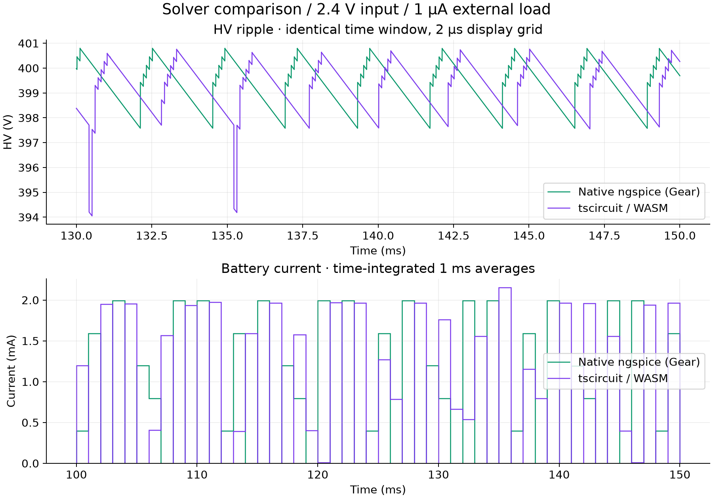

# Native and tscircuit HV simulation comparison

Both workflows are retained: native ngspice for battery/load/corner sweeps, and
`tsci simulate analog` for the board-as-code simulation path. They share the
exploratory power-stage topology generated from `sim/hv/converter.cir`.

## Results on identical windows

2.4 V battery, 1 µA external load, plus the permanently connected 132.412 MΩ
divider. Voltage and battery-current statistics use **100–150 ms in both runs**.
Startup is the first adaptive sample at or above 396 V; switch peak uses 0–150 ms.

| Metric | Native ngspice | tscircuit WASM | Difference |
|---|---:|---:|---:|
| First 396 V crossing | 46.820 ms | 47.020 ms | +0.200 ms |
| Mean HV | 399.303 V | 399.267 V | −0.036 V |
| Minimum HV | 397.574 V | 394.051 V | −3.524 V |
| Maximum HV | 402.118 V | 402.112 V | −0.006 V |
| Peak-to-peak HV | 4.543 V | 8.061 V | +3.518 V |
| Modeled battery current | 0.837 mA | 0.866 mA | +3.51% |
| Switch peak, first 150 ms | 103.107 V | 103.091 V | −0.016 V |

[Full precision table](solver-comparison-table.md) · [JSON](solver-comparison.json)



## Interpretation

Mean output differs by only 0.0091%, startup by 0.43%, and switch peak by
0.015%. These support consistent gross startup and regulation behavior for this
nominal case. They do not establish agreement at the other battery/load corners;
the existing 16-case sweep was run with native ngspice only.

WASM ripple is **77.4% larger**, driven primarily by deeper minimum-voltage dips.
Its modeled battery current is 3.51% higher over the same window. The plots show
burst timing differences; exact switching phase is not an appropriate pass/fail
criterion. The dip difference is unresolved and cannot yet be dismissed as a
numerical artifact or accepted as a physical prediction.

Both implementations use the ngspice family. This is a comparison across builds,
settings and circuit wrappers, not independent validation of the physical model.
Native ngspice 47 uses Gear integration, 2 µs maximum timestep, `reltol=0.001`,
`abstol=1p`, `vntol=1u`, and a 300 ms transient. The pinned tscircuit CLI uses
WASM through eecircuit-engine 1.7.4, a requested 2 µs step and 150 ms duration;
its integration/default tolerances are not asserted to match the native deck.
The CLI also reports ignored internal `.ic` and probe statements in the wrapper;
[the run log](tsci-run.log) preserves them. Per-element initial conditions remain.

The comparison integrates the original adaptive samples with exact interpolated
window boundaries. It does not average rows, which would overweight small steps.
The display uses a 2 µs grid and can miss narrow extrema; the table uses adaptive
data. The earlier native sweep uses 200–300 ms and reports 0.821 mA at this
operating point; that value must not be compared directly with the WASM 100–150 ms
current. Small differences from `tsci-results.json` arise from exact boundary
interpolation in this report. Use this report for cross-solver comparisons.

## Remaining validation

1. Export and archive the actual WASM deck; reconcile wrapper warnings and initial conditions.
2. Match solver settings and run length, then halve maximum timestep and tighten tolerances until extrema and energy converge. Record settings and changes in results.
3. Inspect the deep dips using internal ladder-node traces and switch/diode currents.
4. Repeat both paths at low/high battery and representative load corners.
5. Replace generic switch/diodes and behavioral control with selected device models and parasitics, then correlate with hardware.

These steps have not yet been completed. Neither current estimate includes
controller/drive supply consumption, BLE, or all real device losses. Use neither
as a battery-life prediction or component-stress signoff.

## Reproduce

With the dependencies in the [HV study](README.md) installed:

```sh
bun run sim:sync
bun run sim:native
bun run sim:hv
bun run sim:plots
bun run sim:compare
```

The comparison reads native `build/hv/v2.4_load1/metrics.txt` and the losslessly
compressed actual CLI table `build/tsci/hv-table.txt.gz`. Raw solver outputs stay
in ignored `build/`; scripts, summary metrics, PNG and SVG figures are versioned.
